# QHome Automation System

## 🏠 Project Overview
**QHome** is a comprehensive, full-stack IoT Smart Home solution designed to provide real-time monitoring, automation, and remote control of environmental and power sensors. The system is built on a modular architecture, spanning from custom PCB hardware design to a modern web-based dashboard.

This project integrates embedded systems connectivity (ESP32/ESP8266), robust backend services (NestJS/MQTT), and an interactive frontend (React) to create a seamless smart home experience.

## 🏗️ System Architecture

The system operates on a publish-subscribe model using MQTT for low-latency communication between the hardware nodes and the server.

## 📊 Data Flow Diagram

This diagram illustrates how data moves through the entire system, from sensor acquisition to user visualization.

### Data Flow Description

**1. Sensor Data Acquisition (IoT Node)**
- Physical sensors continuously monitor environmental and power parameters
- Analog sensors output voltage levels converted to digital values via ADC
- Data is processed, calibrated, and packaged into JSON format

**2. Data Transmission (Communication Layer)**
- JSON payload transmitted over WiFi to MQTT broker
- Published to `node/send` topic via WebSocket protocol
- Bidirectional communication allows receiving commands on `node/cmd` topic

**3. Data Processing (Backend Service)**
- MQTT Gateway subscribes to node data streams
- Incoming data is validated and parsed
- Event system triggers parallel operations:
  - Persistent storage in MongoDB collections
  - Real-time broadcast to connected frontend clients via Socket.IO

**4. Data Presentation (Frontend Application)**
- Socket.IO client receives real-time updates for live dashboard
- HTTP client fetches historical data for analytics and trends
- React state management updates UI components reactively

**5. User Control Loop**
- User interactions trigger API calls to backend
- Backend publishes control commands to MQTT broker
- IoT node receives and executes commands (relay control, configuration updates)

## 🔄 Software Flow Diagram

This diagram shows the complete software execution flow from system startup to continuous operation.

```mermaid
flowchart TD
    Start([System Power On]) --> Init_Check{Component<br/>Ready?}
    
    Init_Check -->|Hardware| Init_Hardware[Initialize Hardware<br/>• GPIO Pins<br/>• LCD Display<br/>• Sensors<br/>• Relays]
    Init_Check -->|Backend| Init_Backend[Initialize Backend<br/>• Load Config<br/>• Connect MongoDB<br/>• Start HTTP Server]
    Init_Check -->|Frontend| Init_Frontend[Initialize Frontend<br/>• Load React App<br/>• Check Session<br/>• Setup Routes]
    
    Init_Hardware --> Check_Config{Config<br/>Exists?}
    Check_Config -->|No| AP_Mode[Start WiFi AP Mode<br/>Show Config Portal]
    AP_Mode --> Wait_Config[Wait for User<br/>to Configure WiFi]
    Wait_Config -->|Configured| Save_Config[Save to EEPROM]
    Save_Config --> Connect_WiFi
    
    Check_Config -->|Yes| Connect_WiFi[Connect to WiFi]
    Connect_WiFi --> WiFi_Success{Connected?}
    WiFi_Success -->|No| AP_Mode
    WiFi_Success -->|Yes| Connect_MQTT[Connect to<br/>MQTT Broker]
    
    Connect_MQTT --> MQTT_Success{Connected?}
    MQTT_Success -->|No| Retry_MQTT[Retry Connection<br/>Exponential Backoff]
    Retry_MQTT --> MQTT_Success
    MQTT_Success -->|Yes| Subscribe_Topics[Subscribe to<br/>node/cmd Topic]
    
    Init_Backend --> Connect_DB[Connect to MongoDB]
    Connect_DB --> DB_Success{Connected?}
    DB_Success -->|No| Error_Exit[Log Error & Exit]
    DB_Success -->|Yes| Connect_MQTT_Backend[Connect to<br/>MQTT Broker as Client]
    Connect_MQTT_Backend --> Backend_Subscribe[Subscribe to<br/>node/send Topic]
    Backend_Subscribe --> Start_API[Start REST API<br/>& Socket.IO Server]
    
    Init_Frontend --> Check_Auth{User<br/>Authenticated?}
    Check_Auth -->|No| Show_Login[Show Login Page]
    Show_Login --> User_Login[User Enters<br/>Credentials]
    User_Login --> Validate_Auth[Validate Against<br/>Backend API]
    Validate_Auth --> Auth_Valid{Valid?}
    Auth_Valid -->|No| Show_Login
    Auth_Valid -->|Yes| Store_Session[Store Session<br/>in SessionStorage]
    
    Check_Auth -->|Yes| Load_Dashboard
    Store_Session --> Load_Dashboard[Load Dashboard<br/>Components]
    Load_Dashboard --> Connect_Socket[Connect Socket.IO<br/>to Backend]
    
    Subscribe_Topics --> Ready_Node[Node Ready<br/>Play Beep Sound]
    Start_API --> Ready_Backend[Backend Ready<br/>Log Status]
    Connect_Socket --> Ready_Frontend[Frontend Ready<br/>Display Dashboard]
    
    Ready_Node --> Main_Loop_Node[Main Loop: Node]
    Ready_Backend --> Main_Loop_Backend[Main Loop: Backend]
    Ready_Frontend --> Main_Loop_Frontend[Main Loop: Frontend]
    
    Main_Loop_Node --> Read_Sensors[Read All Sensors<br/>Every Interval]
    Read_Sensors --> Process_Data[Process & Calculate<br/>• Temperature/Humidity<br/>• Gas Level<br/>• Power/Energy<br/>• Motion/Light]
    Process_Data --> Check_Thresholds{Thresholds<br/>Exceeded?}
    Check_Thresholds -->|Yes| Trigger_Alert[Trigger Local Alert<br/>• Activate Buzzer<br/>• Update LCD<br/>• Send MQTT Alert]
    Check_Thresholds -->|No| Check_Sync
    Trigger_Alert --> Check_Sync
    
    Check_Sync{Time to<br/>Sync?} -->|Yes| Publish_Data[Publish JSON<br/>to node/send]
    Check_Sync -->|No| Update_Display
    Publish_Data --> Update_Display[Update LCD<br/>Display Status]
    
    Update_Display --> Listen_Commands[Listen for<br/>MQTT Commands]
    Listen_Commands --> Command_Received{Command?}
    Command_Received -->|Yes| Execute_Command[Execute Command<br/>• Toggle Relay<br/>• Update Config<br/>• Restart]
    Command_Received -->|No| Main_Loop_Node
    Execute_Command --> Main_Loop_Node
    
    Main_Loop_Backend --> Listen_MQTT[Listen for<br/>MQTT Messages]
    Listen_MQTT --> MQTT_Message{Message<br/>Received?}
    MQTT_Message -->|Yes| Parse_Message[Parse Message Type<br/>• _sensor_data<br/>• _alert<br/>• _error<br/>• _ack]
    MQTT_Message -->|No| Handle_HTTP
    
    Parse_Message --> Save_DB[Save to MongoDB<br/>Appropriate Collection]
    Save_DB --> Emit_Socket[Emit to Socket.IO<br/>Connected Clients]
    Emit_Socket --> Handle_HTTP
    
    Handle_HTTP[Handle HTTP Requests<br/>• GET sensor-data<br/>• POST commands<br/>• POST config]
    Handle_HTTP --> API_Request{Request?}
    API_Request -->|GET| Query_DB[Query MongoDB<br/>Return Results]
    API_Request -->|POST| Publish_Command[Publish to<br/>node/cmd Topic]
    API_Request -->|None| Main_Loop_Backend
    Query_DB --> Main_Loop_Backend
    Publish_Command --> Main_Loop_Backend
    
    Main_Loop_Frontend --> Socket_Listen[Listen for<br/>Socket.IO Events]
    Socket_Listen --> Socket_Event{Event<br/>Received?}
    Socket_Event -->|Yes| Update_State[Update React State<br/>Trigger Re-render]
    Socket_Event -->|No| User_Action
    Update_State --> User_Action
    
    User_Action{User<br/>Action?}
    User_Action -->|View Analytics| Fetch_History[Fetch Historical<br/>Data via API]
    User_Action -->|Send Command| Send_Command[Send POST Request<br/>to Backend API]
    User_Action -->|Update Settings| Send_Config[Send Config Update<br/>to Backend API]
    User_Action -->|None| Main_Loop_Frontend
    
    Fetch_History --> Render_Charts[Render Charts<br/>with Recharts]
    Render_Charts --> Main_Loop_Frontend
    Send_Command --> Main_Loop_Frontend
    Send_Config --> Main_Loop_Frontend
    
    style Init_Hardware fill:#e1f5ff
    style Init_Backend fill:#f3e5f5
    style Init_Frontend fill:#e8f5e9
    style Main_Loop_Node fill:#ffebee
    style Main_Loop_Backend fill:#fff3e0
    style Main_Loop_Frontend fill:#e0f2f1
```

## 📂 Project Modules

The repository is organized into four main operational layers. Click on the module links for detailed documentation, installation steps, and API references.

| Module | Directory | Description | Technology |
| :--- | :--- | :--- | :--- |
| **Hardware Design** | [**`/pcb`**](pcb/README.md) | Custom PCB layouts, schematics, and BOM. | Eagle CAD / Fusion 360 |
| **Firmware** | [**`/node`**](node/README.md) | C++ firmware for ESP controllers implementing sensor logic. | Arduino / C++ |
| **Backend API** | [**`/backend`**](backend/README.md) | Server logic, database management, and MQTT processing. | NestJS, MongoDB, TypeScript |
| **Frontend UI** | [**`/frontend`**](frontend/README.md) | Web dashboard for monitoring and control. | React, Vite, Tailwind CSS |

## ✨ Key Features

*   **Real-time Monitoring**: Live streaming of Temperature, Humidity, Air Quality (Gas), and Ambient Light levels.
*   **Energy Management**: Precise AC Voltage, Current, Power (W), and Energy (kWh) metering using ZMPT101B and ACS712 sensors.
*   **Safety & Alerts**: Instant automated alerts for gas leaks, fire detection, or abnormal power usage via Buzzer and MQTT push notifications.
*   **Remote Control**: Toggle lights and appliances remotely via the web dashboard.
*   **Data Analytics**: Historical charts and graphs to track power consumption and environmental trends over time.
*   **Secure Access**: Token-based authentication (Custom Headers) ensuring only authorized users can control the system.

## 🚀 Getting Started

To spin up the entire system locally, follow the **Installation & Setup** guides in each module's README. A high-level startup order is recommended:

1.  **Infrastructure**: Ensure you have a MongoDB instance and an MQTT Broker (e.g., Mosquitto) running.
2.  **Backend**: Start the [Backend Service](backend/README.md) to initialize the API and Database connections.
3.  **Frontend**: Launch the [Web Dashboard](frontend/README.md) to interact with the system.
4.  **Hardware**: Flash the [Firmware](node/README.md) to your ESP32/ESP8266 device and configure it to connect to your Wi-Fi and MQTT Broker.

## 🛠️ Technology Stack

*   **Hardware**: ESP32, ESP8266, DHT11/22, MQ-135, ACS712, ZMPT101B, Relay Modules.
*   **Protocol**: MQTT (Message Queuing Telemetry Transport) over WebSockets.
*   **Server**: Node.js, NestJS, Mongoose.
*   **Database**: MongoDB (NoSQL).
*   **Client**: React.js, TypeScript, Tailwind CSS, Recharts.

---
*Developed by Eshan Chathuranga*
