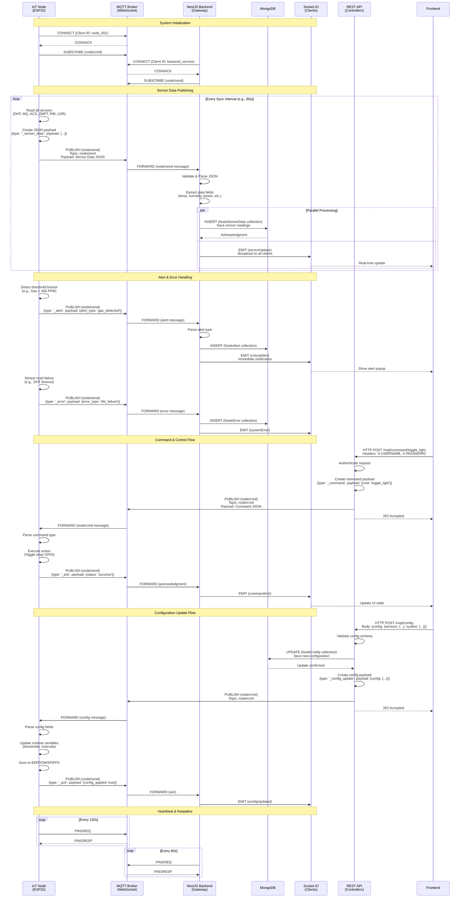

# Backend API Reference

Base URL: `http://localhost:3000/api`

## Authentication
All HTTP endpoints require the following headers:
- `X-USERNAME`: The username configured in environment variables.
- `X-PASSWORD`: The password configured in environment variables.

---

## 📡 MQTT Message Flow Diagram

This diagram illustrates the complete message flow between IoT nodes, MQTT broker, and the backend service.



### Message Type Reference

| Message Type | Direction | Topic | Purpose |
|--------------|-----------|-------|---------|
| `_sensor_data` | Node → Backend | `node/send` | Regular telemetry data transmission |
| `_alert` | Node → Backend | `node/send` | Critical safety events (gas, fire, motion) |
| `_error` | Node → Backend | `node/send` | System faults and sensor failures |
| `_ack` | Node → Backend | `node/send` | Command acknowledgment responses |
| `_command` | Backend → Node | `node/cmd` | Immediate control actions (toggle, restart) |
| `_config_update` | Backend → Node | `node/cmd` | Configuration parameter updates |

---

## HTTP Endpoints

### 1. System Status
Get the current configuration from the database (mirrors the node's config).

- **URL**: `/mqtt/status`
- **Method**: `GET`
- **Response**: `200 OK`
```json
// Returns NodeConfig object
{
    "_id": "...",
    "node_name": "Living Room",
    "wifi_password": "...",
    "sync_interval": 60000,
    "sensors": { ... }
}
```

### 2. Error Logs
Get a list of recent error reports from the node.

- **URL**: `/mqtt/errors`
- **Method**: `GET`
- **Query Params**:
    - `limit`: (Optional) Number of records to return. Default: 10.
- **Response**: `200 OK`
```json
[
    {
        "error_type": "dht_read_failure",
        "message": "Failed to read from DHT sensor",
        "createdAt": "2026-01-13T10:00:00.000Z"
    }
]
```

### 3. Alert Logs
Get a list of critical alerts (Gas, Fire, Motion).

- **URL**: `/mqtt/alerts`
- **Method**: `GET`
- **Query Params**:
    - `limit`: (Optional) Number of records to return. Default: 10.
- **Response**: `200 OK`
```json
[
    {
        "alert_type": "gas_detected",
        "message": "High gas levels detected!",
        "createdAt": "2026-01-13T10:05:00.000Z"
    }
]
```

### 4. Historical Sensor Data
Get aggregated sensor readings for a specific date.

- **URL**: `/mqtt/sensor-data/:date`
- **Method**: `GET`
- **URL Params**:
    - `date`: Valid Javascript Timestamp (ms).
- **Response**: `200 OK`
```json
[
    {
        "tempeture": 28.5,
        "humidity": 60,
        "mq_value": 150,
        "acs_power": 120.5,
        "createdAt": "..."
    }
]
```

### 5. Send Command
Send an immediate control command to the node.

- **URL**: `/mqtt/command/:cmd`
- **Method**: `POST`
- **URL Params**:
    - `cmd`: Valid command type. 
      - `restart`
      - `reset_config`
      - `toggle_light`
      - `toggle_light_off`
- **Response**: `202 Accepted`

### 6. Update Configuration
Update the system configuration and push changes to the node via MQTT.

- **URL**: `/mqtt/config`
- **Method**: `POST`
- **Body**:
```json
{
  "config": {
    "system": {
      "wifi_password": "newpass",
      "sync_interval": 30000
    },
    "sensors": {
      "dht_sensor": {
        "enabled": true,
        "high_temp_value": 40,
        "low_temp_value": 0,
        "read_interval": 2000
      },
      // ... other sensors
    }
  }
}
```
- **Response**: `202 Accepted`

---

## MQTT Interface

The backend acts as an MQTT Client wrapper.

### Subscribed Topics
- **`node/send`**: Listens for payloads from the node.
    - **Wrappers**:
        - `_ack`: Handshake payload.
        - `_sensor_data`: Telemetry.
        - `_alert`: Critical events.
        - `_error`: System faults.

### Published Topics
- **`node/cmd`**: Used to send commands to the node.
    - Payload Structure:
    ```json
    {
        "type": "_config_update" | "_command",
        "payload": { ... }
    }
    ```
