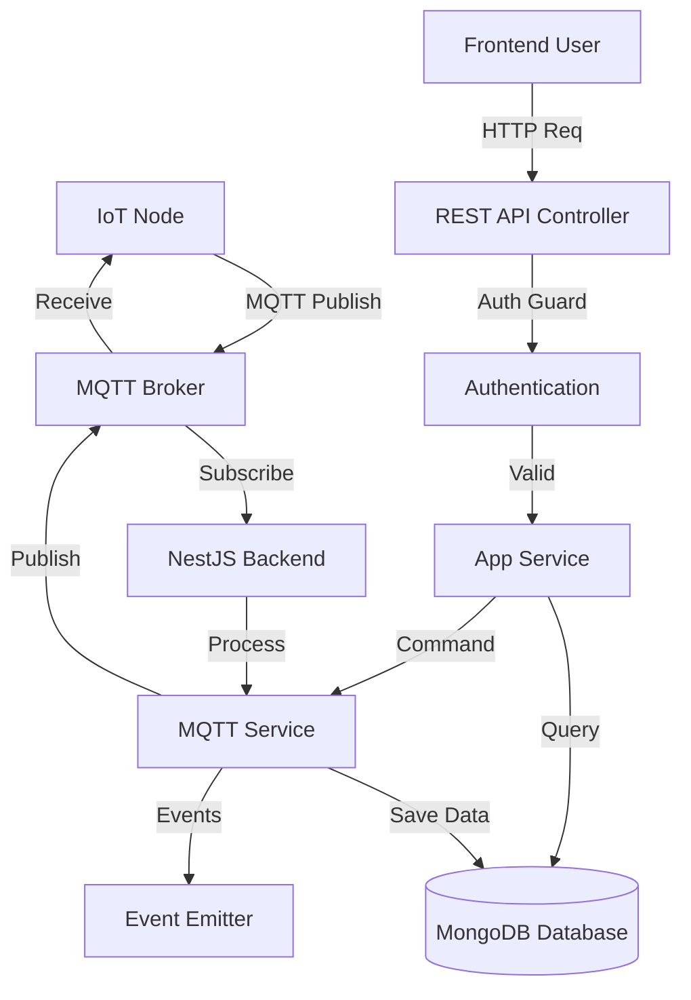

# Backend Service - QHome Automation System

## Overview
The **Backend Service** acts as the central intelligence of the Home Automation System. It is built with **NestJS** and serves two primary roles:
1.  **API Server**: Provides a RESTful API for the frontend dashboard to fetch data and update settings.
2.  **MQTT Broker/Client**: Connects to the IoT Nodes via MQTT (over WebSockets) to receive sensor telemetry and dispatch control commands.

## Technology Stack

| Category | Technology | Usage |
| :--- | :--- | :--- |
| **Framework** | [NestJS](https://nestjs.com/) | Server-side application framework |
| **Language** | [TypeScript](https://www.typescriptlang.org/) | Type-safe development |
| **Database** | [MongoDB](https://www.mongodb.com/) | NoSQL database for flexible sensor data storage |
| **ODM** | [Mongoose](https://mongoosejs.com/) | Object Data Modeling for MongoDB |
| **Messaging** | [MQTT](https://mqtt.org/) | IoT communication protocol |
| **Runtime** | [Node.js](https://nodejs.org/) | JavaScript runtime environment |

## Architecture

The backend follows a modular monolith architecture provided by NestJS.



## Directory Structure
```
backend/
├── src/
│   ├── mqtt/               # MQTT Module
│   │   ├── mqtt.gateway.ts # Handles socket events
│   │   ├── mqtt.service.ts # Business logic for messaging
│   │   └── auth.guard.ts   # API Authentication
│   ├── schema/             # Mongoose Data Models
│   │   ├── node.sensor.data.schema.ts
│   │   ├── node.config.schema.ts
│   │   └── ...
│   ├── app.module.ts       # Root Module
│   └── main.ts             # Entry point
└── package.json
```

## Documentation
- [API Reference](API.md) - Detailed description of HTTP Endpoints and MQTT topics.

## Data Models

The system uses MongoDB schemas to organize data:

*   **NodeSensorData**: Stores historical readings (Temp, Humidity, Gas, Light, Power).
*   **NodeConfig**: Remote configuration for nodes (Thresholds, Intervals).
*   **NodeAlert**: Critical events (Gas leak, Fire detection).
*   **NodeError**: System health logs (Sensor failures).

## API & Authentication

### Security
The API is protected using custom headers. All HTTP requests must include:
*   `X-USERNAME`: Configured username
*   `X-PASSWORD`: Configured password

### Integration
The backend connects to an MQTT broker over **WebSockets** (host: `158.101.98.79`, port: `9001`). This allows it to function in environments where raw TCP MQTT ports might be restricted, and enables easy integration with web-based clients.

## Installation & Setup

### Prerequisites
*   Node.js (v18+)
*   MongoDB Instance (Local or Atlas)
*   MQTT Broker (Mosquitto or similar, supporting WebSockets)

### Environment Variables
Create a `.env` file in the root directory:
```env
MONGO_URI=mongodb://localhost:27017/qhome
API_USERNAME=admin
API_PASSWORD=secret
PORT=3000
```

### Steps

1.  **Install Application**
    ```bash
    cd backend
    npm install
    ```

2.  **Start Development Server**
    ```bash
    npm run start:dev
    ```
    The server will start on `http://localhost:3000` (API) and connect to the MQTT Broker.

3.  **Build for Production**
    ```bash
    npm run build
    npm run start:prod
    ```

## Visuals


---
