# Backend Service - QHome Automation System

## Overview
The **Backend Service** acts as the central intelligence of the Home Automation System. It is built with **NestJS** and serves two primary roles:
1.  **API Server**: Provides a RESTful API for the frontend dashboard to fetch data and update settings.
2.  **MQTT Broker/Client**: Connects to the IoT Nodes via MQTT (over WebSockets) to receive sensor telemetry and dispatch control commands.

## Technology Stack

| Category | Technology | Usage |
| :--- | :--- | :--- |
| **Framework** | [NestJS](https://nestjs.com/) | Server-side application framework |
| **Language** | [TypeScript](https://www.typescriptlang.org/) | Type-safe development |
| **Database** | [MongoDB](https://www.mongodb.com/) | NoSQL database for flexible sensor data storage |
| **ODM** | [Mongoose](https://mongoosejs.com/) | Object Data Modeling for MongoDB |
| **Messaging** | [MQTT](https://mqtt.org/) | IoT communication protocol |
| **Runtime** | [Node.js](https://nodejs.org/) | JavaScript runtime environment |

## Architecture

The backend follows a modular monolith architecture provided by NestJS.


## 🔄 Data Processing Flow

This diagram details how the backend processes incoming MQTT messages and serves data to clients.

```mermaid
flowchart TD
    Start([MQTT Message Received]) --> Gateway[MQTT Gateway<br/>mqtt.gateway.ts]
    Gateway --> ParseMessage{Parse Message<br/>Structure}
    
    ParseMessage -->|Valid JSON| ExtractType[Extract Message Type<br/>from payload.type]
    ParseMessage -->|Invalid| LogError[Log Parse Error]
    LogError --> SendErrorResponse[Emit Error Event]
    SendErrorResponse --> End1([End])
    
    ExtractType --> TypeSwitch{Message Type?}
    
    TypeSwitch -->|_sensor_data| ProcessSensor[Process Sensor Data]
    TypeSwitch -->|_alert| ProcessAlert[Process Alert]
    TypeSwitch -->|_error| ProcessError[Process Error]
    TypeSwitch -->|_ack| ProcessAck[Process Acknowledgment]
    TypeSwitch -->|Unknown| LogUnknown[Log Unknown Type]
    LogUnknown --> End2([End])
    
    ProcessSensor --> ValidateSensor[Validate Sensor Schema<br/>• Check required fields<br/>• Validate data types<br/>• Range validation]
    ValidateSensor --> SensorValid{Valid?}
    SensorValid -->|No| LogValidationError[Log Validation Error]
    LogValidationError --> End3([End])
    
    SensorValid -->|Yes| TransformData[Transform Data<br/>• Convert units<br/>• Calculate derived values<br/>• Add timestamp]
    TransformData --> CreateSensorDoc[Create NodeSensorData<br/>Document]
    
    CreateSensorDoc --> SaveSensor[Save to MongoDB<br/>nodeSensorData collection]
    SaveSensor --> SensorSaved{Saved?}
    SensorSaved -->|Error| LogDBError1[Log Database Error]
    LogDBError1 --> End4([End])
    
    SensorSaved -->|Success| EmitSensorEvent[Emit 'sensorUpdate' Event]
    EmitSensorEvent --> BroadcastSocket1[Broadcast via Socket.IO<br/>to all connected clients]
    BroadcastSocket1 --> CheckThresholds[Check Alert Thresholds<br/>• Temperature limits<br/>• Gas levels<br/>• Power anomalies]
    CheckThresholds --> ThresholdExceeded{Threshold<br/>Exceeded?}
    ThresholdExceeded -->|Yes| CreateAutoAlert[Create Automatic Alert]
    CreateAutoAlert --> ProcessAlert
    ThresholdExceeded -->|No| End5([End])
    
    ProcessAlert --> ValidateAlert[Validate Alert Schema<br/>• alert_type required<br/>• Validate severity]
    ValidateAlert --> AlertValid{Valid?}
    AlertValid -->|No| LogAlertError[Log Validation Error]
    LogAlertError --> End6([End])
    
    AlertValid -->|Yes| EnrichAlert[Enrich Alert Data<br/>• Add timestamp<br/>• Add severity level<br/>• Add node identifier]
    EnrichAlert --> CreateAlertDoc[Create NodeAlert<br/>Document]
    CreateAlertDoc --> SaveAlert[Save to MongoDB<br/>nodeAlert collection]
    SaveAlert --> AlertSaved{Saved?}
    AlertSaved -->|Error| LogDBError2[Log Database Error]
    LogDBError2 --> End7([End])
    
    AlertSaved -->|Success| EmitAlertEvent[Emit 'criticalAlert' Event]
    EmitAlertEvent --> BroadcastSocket2[Broadcast via Socket.IO<br/>HIGH PRIORITY]
    BroadcastSocket2 --> TriggerNotification[Trigger Push Notification<br/>If configured]
    TriggerNotification --> End8([End])
    
    ProcessError --> ValidateError[Validate Error Schema<br/>• error_type required<br/>• Validate message]
    ValidateError --> ErrorValid{Valid?}
    ErrorValid -->|No| LogErrorValidation[Log Validation Error]
    LogErrorValidation --> End9([End])
    
    ErrorValid -->|Yes| CreateErrorDoc[Create NodeError<br/>Document]
    CreateErrorDoc --> SaveError[Save to MongoDB<br/>nodeError collection]
    SaveError --> ErrorSaved{Saved?}
    ErrorSaved -->|Error| LogDBError3[Log Database Error]
    LogDBError3 --> End10([End])
    
    ErrorSaved -->|Success| EmitErrorEvent[Emit 'systemError' Event]
    EmitErrorEvent --> BroadcastSocket3[Broadcast via Socket.IO]
    BroadcastSocket3 --> CheckCritical{Critical<br/>Error?}
    CheckCritical -->|Yes| SendAdminAlert[Send Admin Notification]
    SendAdminAlert --> End11([End])
    CheckCritical -->|No| End12([End])
    
    ProcessAck --> LogAck[Log Acknowledgment]
    LogAck --> UpdateCommandStatus[Update Command Status<br/>In tracking system]
    UpdateCommandStatus --> EmitAckEvent[Emit 'commandAck' Event]
    EmitAckEvent --> BroadcastSocket4[Broadcast via Socket.IO]
    BroadcastSocket4 --> End13([End])
    
    style ProcessSensor fill:#e3f2fd
    style ProcessAlert fill:#ffebee
    style ProcessError fill:#fff3e0
    style ProcessAck fill:#e8f5e9
    style SaveSensor fill:#f3e5f5
    style SaveAlert fill:#f3e5f5
    style SaveError fill:#f3e5f5
```



### Data Processing Pipeline Stages

**1. Message Reception & Parsing**
- MQTT Gateway receives raw message from broker
- JSON parsing with error handling
- Message type extraction from payload structure

**2. Validation Layer**
- Schema validation using TypeScript interfaces
- Required field verification
- Data type and range checks
- Malformed data rejection with logging

**3. Data Transformation**
- Unit conversions (e.g., ADC values to physical units)
- Calculated fields (e.g., power = voltage × current)
- Timestamp normalization
- Data enrichment with metadata

**4. Persistence Layer**
- Mongoose ODM for MongoDB operations
- Atomic write operations
- Error handling and retry logic
- Index optimization for queries

**5. Event Broadcasting**
- Event-driven architecture using NestJS EventEmitter
- Socket.IO real-time push to connected clients
- Priority-based message queuing for alerts
- Client-specific filtering and routing

**6. Threshold Monitoring**
- Continuous evaluation of sensor values against configured thresholds
- Automatic alert generation for anomalies
- Cascading alert processing
- Rate limiting to prevent alert storms

---

## 🌐 REST API Request Flow

```mermaid
flowchart TD
    HTTPRequest([HTTP Request]) --> Controller[API Controller<br/>@Controller /mqtt]
    Controller --> CheckAuth{Authentication<br/>Guard}
    
    CheckAuth -->|Missing Headers| Return401[Return 401<br/>Unauthorized]
    Return401 --> EndReq1([End Request])
    
    CheckAuth -->|Invalid Credentials| Return403[Return 403<br/>Forbidden]
    Return403 --> EndReq2([End Request])
    
    CheckAuth -->|Valid| RouteMethod{Route<br/>Method?}
    
    RouteMethod -->|GET /status| GetStatus[Query NodeConfig<br/>from MongoDB]
    GetStatus --> ReturnConfig[Return 200<br/>with config JSON]
    ReturnConfig --> EndReq3([End Request])
    
    RouteMethod -->|GET /errors| GetErrors[Query NodeError<br/>Collection]
    GetErrors --> ApplyLimit[Apply Limit Query Param]
    ApplyLimit --> SortDesc[Sort by createdAt DESC]
    SortDesc --> ReturnErrors[Return 200<br/>with error array]
    ReturnErrors --> EndReq4([End Request])
    
    RouteMethod -->|GET /alerts| GetAlerts[Query NodeAlert<br/>Collection]
    GetAlerts --> ApplyLimitAlerts[Apply Limit Query Param]
    ApplyLimitAlerts --> SortDescAlerts[Sort by createdAt DESC]
    SortDescAlerts --> ReturnAlerts[Return 200<br/>with alert array]
    ReturnAlerts --> EndReq5([End Request])
    
    RouteMethod -->|GET /sensor-data/:date| ParseDate[Parse Date Parameter]
    ParseDate --> DateValid{Valid<br/>Timestamp?}
    DateValid -->|No| Return400[Return 400<br/>Bad Request]
    Return400 --> EndReq6([End Request])
    DateValid -->|Yes| QueryByDate[Query NodeSensorData<br/>by date range]
    QueryByDate --> Aggregate[Aggregate & Group Data]
    Aggregate --> ReturnData[Return 200<br/>with sensor data array]
    ReturnData --> EndReq7([End Request])
    
    RouteMethod -->|POST /command/:cmd| ValidateCommand[Validate Command Type]
    ValidateCommand --> CommandValid{Valid<br/>Command?}
    CommandValid -->|No| Return400Cmd[Return 400<br/>Invalid Command]
    Return400Cmd --> EndReq8([End Request])
    
    CommandValid -->|Yes| CreateCmdPayload[Create Command Payload<br/>{type: "_command", payload: {cmd: ...}}]
    CreateCmdPayload --> PublishMQTT1[Publish to MQTT<br/>Topic: node/cmd]
    PublishMQTT1 --> MQTTPublished1{Published?}
    MQTTPublished1 -->|Error| Return500Pub1[Return 500<br/>Publish Failed]
    Return500Pub1 --> EndReq9([End Request])
    MQTTPublished1 -->|Success| Return202Cmd[Return 202<br/>Accepted]
    Return202Cmd --> EndReq10([End Request])
    
    RouteMethod -->|POST /config| ValidateConfigSchema[Validate Config Schema<br/>against interface]
    ValidateConfigSchema --> ConfigValid{Valid<br/>Schema?}
    ConfigValid -->|No| Return400Config[Return 400<br/>Invalid Config]
    Return400Config --> EndReq11([End Request])
    
    ConfigValid -->|Yes| UpdateDBConfig[Update NodeConfig<br/>in MongoDB]
    UpdateDBConfig --> DBUpdated{Updated?}
    DBUpdated -->|Error| Return500DB[Return 500<br/>Database Error]
    Return500DB --> EndReq12([End Request])
    
    DBUpdated -->|Success| CreateConfigPayload[Create Config Payload<br/>{type: "_config_update", payload: {config: ...}}]
    CreateConfigPayload --> PublishMQTT2[Publish to MQTT<br/>Topic: node/cmd]
    PublishMQTT2 --> MQTTPublished2{Published?}
    MQTTPublished2 -->|Error| Return500Pub2[Return 500<br/>Publish Failed]
    Return500Pub2 --> EndReq13([End Request])
    MQTTPublished2 -->|Success| Return202Config[Return 202<br/>Accepted]
    Return202Config --> EndReq14([End Request])
    
    style CheckAuth fill:#ffebee
    style GetStatus fill:#e3f2fd
    style GetErrors fill:#e3f2fd
    style GetAlerts fill:#e3f2fd
    style QueryByDate fill:#e3f2fd
    style PublishMQTT1 fill:#fff3e0
    style PublishMQTT2 fill:#fff3e0
    style UpdateDBConfig fill:#f3e5f5
```

---

## Directory Structure
```
backend/
├── src/
│   ├── mqtt/               # MQTT Module
│   │   ├── mqtt.gateway.ts # Handles socket events
│   │   ├── mqtt.service.ts # Business logic for messaging
│   │   └── auth.guard.ts   # API Authentication
│   ├── schema/             # Mongoose Data Models
│   │   ├── node.sensor.data.schema.ts
│   │   ├── node.config.schema.ts
│   │   └── ...
│   ├── app.module.ts       # Root Module
│   └── main.ts             # Entry point
└── package.json
```

## Documentation
- [API Reference](API.md) - Detailed description of HTTP Endpoints and MQTT topics.

## Data Models

The system uses MongoDB schemas to organize data:

*   **NodeSensorData**: Stores historical readings (Temp, Humidity, Gas, Light, Power).
*   **NodeConfig**: Remote configuration for nodes (Thresholds, Intervals).
*   **NodeAlert**: Critical events (Gas leak, Fire detection).
*   **NodeError**: System health logs (Sensor failures).

## API & Authentication

### Security
The API is protected using custom headers. All HTTP requests must include:
*   `X-USERNAME`: Configured username
*   `X-PASSWORD`: Configured password

### Integration
The backend connects to an MQTT broker over **WebSockets** (host: `158.101.98.79`, port: `9001`). This allows it to function in environments where raw TCP MQTT ports might be restricted, and enables easy integration with web-based clients.

## Installation & Setup

### Prerequisites
*   Node.js (v18+)
*   MongoDB Instance (Local or Atlas)
*   MQTT Broker (Mosquitto or similar, supporting WebSockets)

### Environment Variables
Create a `.env` file in the root directory:
```env
MONGO_URI=mongodb://localhost:27017/qhome
API_USERNAME=admin
API_PASSWORD=secret
PORT=3000
```

### Steps

1.  **Install Application**
    ```bash
    cd backend
    npm install
    ```

2.  **Start Development Server**
    ```bash
    npm run start:dev
    ```
    The server will start on `http://localhost:3000` (API) and connect to the MQTT Broker.

3.  **Build for Production**
    ```bash
    npm run build
    npm run start:prod
    ```

## Visuals


---
