# Frontend Web Application - QHome Automation System

## Overview
The **Frontend Web Application** serves as the user interface for the Smart Home Automation System. Built with **React** and **Vite**, it provides a responsive, modern dashboard for real-time monitoring, control, and data analysis of connected IoT nodes.

## Features
- **📊 Real-time Dashboard**: Live monitoring of sensor data (Temperature, Humidity, Gas, Power, etc.) via Websockets/MQTT integration.
- **🔐 Secure Authentication**: User verification system protecting access to controls and configuration.
- **📈 Analytics**: Interactive charts visualizing historical sensor data using `recharts`.
- **⚙️ Remote Configuration**: Interface to update system settings and node parameters remotely.
- **📱 Responsive Design**: Built with **Tailwind CSS** for a seamless experience across desktop and mobile devices.

## Technology Stack

| Category | Technology | Usage |
| :--- | :--- | :--- |
| **Framework** | [React 18+](https://react.dev/) | Component-based UI architecture |
| **Build Tool** | [Vite](https://vitejs.dev/) | Ultra-fast development server and bundling |
| **Styling** | [Tailwind CSS](https://tailwindcss.com/) | Utility-first CSS framework |
| **Routing** | [React Router 6](https://reactrouter.com/) | Client-side navigation |
| **Charts** | [Recharts](https://recharts.org/) | Data visualization |
| **Icons** | [Lucide React](https://lucide.dev/) | Consistent & clean icon set |
| **Connectivity** | [Socket.io-client](https://socket.io/) | Real-time bidirectional communication |

## Application Structure

### Directory Layout
```
frontend/
├── src/
│   ├── components/     # UI Pages & Widgets
│   │   ├── Analytics.tsx
│   │   ├── Dashboard.tsx
│   │   ├── Layout.tsx
│   │   ├── Login.tsx
│   │   └── Settings.tsx
│   ├── hooks/          # Custom React Hooks
│   ├── utils/          # API & Helper functions
│   ├── App.tsx         # Main Routing Logic
│   └── main.tsx        # Entry Point
├── images/             # Documentation screenshots
└── package.json        # Dependencies & Scripts
```

## User Interface

### 1. Dashboard
The central hub displaying live cards for all active nodes.


### 2. Analytics
Historical data visualization for power consumption and environmental trends.


### 3. Settings
Configuration panel for user management and system preferences.


### 4. Login
Secure entry point.


## System Architecture

### Application Flow


## 👤 User Interaction Flow Diagram

This diagram shows detailed user journeys through the application and how actions trigger backend operations.

```mermaid
flowchart TD
    Start([User Opens Browser]) --> LoadApp[Load React Application]
    LoadApp --> CheckSession{Session<br/>Storage?}
    
    CheckSession -->|No Session| ShowLogin[Render Login Component]
    ShowLogin --> UserInput[User Enters<br/>Username & Password]
    UserInput --> ValidateInput{Input<br/>Validation}
    ValidateInput -->|Empty Fields| ShowInputError[Show Validation Error]
    ShowInputError --> UserInput
    
    ValidateInput -->|Valid| SendAuthRequest[POST Request to Backend<br/>Headers: X-USERNAME, X-PASSWORD]
    SendAuthRequest --> WaitResponse[Wait for Response]
    WaitResponse --> AuthResponse{Response?}
    
    AuthResponse -->|401/403| ShowAuthError[Show Authentication Error<br/>'Invalid Credentials']
    ShowAuthError --> UserInput
    
    AuthResponse -->|200 OK| SaveSession[Store Credentials<br/>in SessionStorage]
    SaveSession --> InitSocket[Initialize Socket.IO Connection]
    
    CheckSession -->|Valid Session| InitSocket
    InitSocket --> ConnectSocket[Connect to Backend<br/>ws://backend:3000]
    ConnectSocket --> SocketConnected{Connected?}
    SocketConnected -->|Error| ShowConnError[Show Connection Error<br/>Retry Logic]
    ShowConnError --> ConnectSocket
    
    SocketConnected -->|Success| SubscribeEvents[Subscribe to Socket Events<br/>• sensorUpdate<br/>• criticalAlert<br/>• commandAck<br/>• systemError]
    SubscribeEvents --> LoadLayout[Render Main Layout<br/>• Sidebar Navigation<br/>• Header with User Info<br/>• Content Outlet]
    
    LoadLayout --> NavigateDashboard[Default Route: Dashboard]
    
    NavigateDashboard --> RenderDashboard[Render Dashboard Component]
    RenderDashboard --> FetchInitialData[Fetch Initial Data<br/>GET /mqtt/status]
    FetchInitialData --> DisplayCards[Display Sensor Cards<br/>• Temperature/Humidity<br/>• Gas Level<br/>• Power Metrics<br/>• Light Status<br/>• Motion Status]
    
    DisplayCards --> MainLoop[Main Application Loop]
    
    MainLoop --> WaitEvent{User Action<br/>or Event?}
    
    WaitEvent -->|Socket: sensorUpdate| UpdateDashboard[Update Dashboard State<br/>Trigger Re-render]
    UpdateDashboard --> AnimateChange[Animate Value Changes]
    AnimateChange --> MainLoop
    
    WaitEvent -->|Socket: criticalAlert| ShowAlertModal[Show Alert Modal<br/>with Alert Details]
    ShowAlertModal --> PlayAlertSound[Play Alert Sound<br/>if enabled]
    PlayAlertSound --> MainLoop
    
    WaitEvent -->|Click: Quick Action Button| QuickAction{Action Type?}
    QuickAction -->|Toggle Light| SendToggleCmd[POST /mqtt/command/toggle_light]
    SendToggleCmd --> ShowLoading1[Show Loading Spinner]
    ShowLoading1 --> CmdResponse1{Response?}
    CmdResponse1 -->|202 Accepted| ShowSuccess1[Show Success Toast]
    ShowSuccess1 --> WaitAck1[Wait for Socket 'commandAck']
    WaitAck1 --> UpdateUI1[Update UI State]
    UpdateUI1 --> MainLoop
    CmdResponse1 -->|Error| ShowError1[Show Error Toast]
    ShowError1 --> MainLoop
    
    QuickAction -->|Restart System| ConfirmRestart[Show Confirmation Dialog]
    ConfirmRestart --> UserConfirm1{Confirmed?}
    UserConfirm1 -->|No| MainLoop
    UserConfirm1 -->|Yes| SendRestartCmd[POST /mqtt/command/restart]
    SendRestartCmd --> ShowLoading2[Show Loading Spinner]
    ShowLoading2 --> MainLoop
    
    WaitEvent -->|Click: Analytics Nav| NavigateAnalytics[Navigate to /analytics]
    NavigateAnalytics --> RenderAnalytics[Render Analytics Component]
    RenderAnalytics --> SelectDateRange[User Selects Date Range<br/>via Date Picker]
    SelectDateRange --> FetchHistorical[GET /mqtt/sensor-data/:date<br/>for each day in range]
    FetchHistorical --> ProcessData[Process & Aggregate Data<br/>• Calculate averages<br/>• Find min/max<br/>• Group by time intervals]
    ProcessData --> RenderCharts[Render Recharts Components<br/>• Line Chart: Temperature<br/>• Area Chart: Power Consumption<br/>• Bar Chart: Gas Levels]
    RenderCharts --> ChartsDisplayed[Display Interactive Charts<br/>with tooltips & zoom]
    ChartsDisplayed --> MainLoop
    
    WaitEvent -->|Click: Settings Nav| NavigateSettings[Navigate to /settings]
    NavigateSettings --> RenderSettings[Render Settings Component]
    RenderSettings --> DisplayForms[Display Configuration Forms<br/>• Node Settings<br/>• Sensor Thresholds<br/>• Sync Intervals]
    DisplayForms --> UserEditSettings[User Modifies Settings]
    UserEditSettings --> ValidateSettings{Valid<br/>Input?}
    ValidateSettings -->|No| ShowFormError[Show Form Validation Error]
    ShowFormError --> UserEditSettings
    
    ValidateSettings -->|Yes| ClickSave[User Clicks Save Button]
    ClickSave --> SendConfigUpdate[POST /mqtt/config<br/>Body: Updated Config JSON]
    SendConfigUpdate --> ShowLoading3[Show Loading Spinner]
    ShowLoading3 --> ConfigResponse{Response?}
    ConfigResponse -->|202 Accepted| ShowSuccess2[Show Success Toast<br/>'Configuration Updated']
    ShowSuccess2 --> WaitConfigAck[Wait for Socket 'configUpdated']
    WaitConfigAck --> RefreshSettings[Refresh Settings Display]
    RefreshSettings --> MainLoop
    ConfigResponse -->|Error| ShowError2[Show Error Toast<br/>Display Error Message]
    ShowError2 --> MainLoop
    
    WaitEvent -->|Click: Logout| ConfirmLogout[Show Confirmation Dialog]
    ConfirmLogout --> UserConfirm2{Confirmed?}
    UserConfirm2 -->|No| MainLoop
    UserConfirm2 -->|Yes| ClearSession[Clear SessionStorage]
    ClearSession --> DisconnectSocket[Disconnect Socket.IO]
    DisconnectSocket --> RedirectLogin[Redirect to Login Page]
    RedirectLogin --> ShowLogin
    
    WaitEvent -->|Socket: Disconnect| ShowReconnect[Show Reconnection Banner]
    ShowReconnect --> AttemptReconnect[Auto Reconnect Logic<br/>Exponential Backoff]
    AttemptReconnect --> ReconnectSuccess{Reconnected?}
    ReconnectSuccess -->|Yes| HideBanner[Hide Banner]
    HideBanner --> MainLoop
    ReconnectSuccess -->|No| ShowReconnectFailed[Show Connection Failed<br/>Manual Retry Option]
    ShowReconnectFailed --> UserRetry{User<br/>Retry?}
    UserRetry -->|Yes| ConnectSocket
    UserRetry -->|No| End([Application Idle])
    
    style ShowLogin fill:#ffebee
    style RenderDashboard fill:#e3f2fd
    style RenderAnalytics fill:#e8f5e9
    style RenderSettings fill:#fff3e0
    style ShowAlertModal fill:#ffcdd2
    style SendToggleCmd fill:#c8e6c9
    style SendConfigUpdate fill:#ffe0b2
```



### User Journey Highlights

**1. Authentication Flow**
- Session-based authentication using SessionStorage
- Credentials validated against backend API
- Persistent login across page refreshes
- Secure logout with session cleanup

**2. Real-time Dashboard Updates**
- WebSocket connection for live sensor data
- Automatic UI updates without page refresh
- Visual animations for value changes
- Critical alert notifications with sound

**3. Device Control**
- Quick action buttons for common commands
- Loading states and user feedback
- Acknowledgment tracking via Socket.IO
- Error handling with retry options

**4. Analytics & Historical Data**
- Interactive date range selection
- Multi-day data aggregation
- Responsive chart visualizations
- Export capabilities for data analysis

**5. Configuration Management**
- Form-based settings interface
- Client-side validation before submission
- Real-time sync confirmation
- Rollback capability on errors

**6. Error Handling & Recovery**
- Graceful connection loss handling
- Automatic reconnection with exponential backoff
- User-friendly error messages
- Manual retry mechanisms

---

### Component Hierarchy


## Installation & Setup

### Prerequisites
- **Node.js**: v16 or higher
- **npm**: v7 or higher

### Steps
1.  **Navigate to frontend directory**:
    ```bash
    cd frontend
    ```
2.  **Install Dependencies**:
    ```bash
    npm install
    ```
3.  **Environment Setup**:
    Create a `.env` file (optional if defaults are used) to specify the backend URL.
    ```env
    VITE_API_URL=http://localhost:3000
    ```
4.  **Run Development Server**:
    ```bash
    npm run dev
    ```
    Access the app at `http://localhost:5173`.

5.  **Build for Production**:
    ```bash
    npm run build
    ```

## Integration Details
*   **Authentication**: Uses custom Headers `X-USERNAME` and `X-PASSWORD` stored in SessionStorage.
*   **Data Fetching**: The `src/utils/api.ts` module handles HTTP requests with automatic auth header injection.
*   **Real-time Updates**: Socket.io connects to the backend to receive live updates from the MQTT gateway, updating the Dashboard state without page reloads.

---
