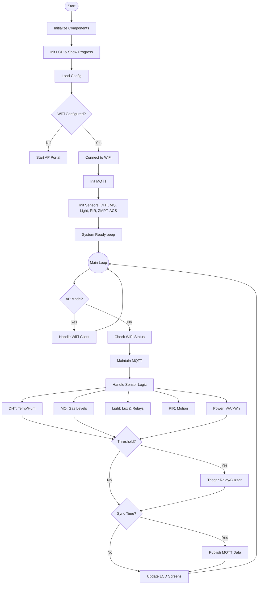

# Node Firmware - QHome Automation System

## Overview
This directory contains the firmware source code for the **- QHome Automation Node**. The firmware is designed to run on ESP-based microcontrollers (e.g., ESP8266 or ESP32), managing a suite of environmental and power monitoring sensors while maintaining real-time communication with the central server via MQTT.

## Directory Structure
- **`main/`**: The core Arduino sketch files using a modular `.ino` structure.
    - `main.ino`: Application entry point and orchestrator.
    - `config.*`: Configuration management.
    - `mqtt.*`: MQTT protocol implementation.
    - `*_sensor.*`: Driver logic for individual sensors.
- **`libraries/`**: Local copies of required libraries ensuring compatibility and portability.
- **`images/`**: Documentation assets.

## Hardware Support
The firmware is built to drive a specific PCB layout (see `../pcb/`) populated with the following components:

### Sensors
- **DHT11/DHT22**: Temperature and Humidity monitoring.
- **MQ Series (e.g., MQ-2, MQ-135)**: Air quality and gas detection.
- **PIR Sensor**: Motion detection for security or presence automation.
- **LDR (Light Dependent Resistor)**: Ambient light level sensing.
- **ZMPT101B**: AC Voltage sensing.
- **ACS712**: Current sensing.

### Outputs
- **LCD I2C (16x2 or 20x4)**: Visual status feedback.
- **Buzzer/Alarm**: Audible feedback for alerts and startup confirmation.

## Pin Configuration
The firmware is pre-configured for the following [ESP32](https://www.espressif.com/en/products/socs/esp32) pin mapping.

| Component | Pin (GPIO) | Type | Description |
| :--- | :--- | :--- | :--- |
| **Connectivity** | | | |
| WiFi Indicator LED | 15 | Output | Blinks/On when connected |
| WiFi Reset Button | 18 | Input | Hold 5s to reset credentials |
| **System** | | | |
| System Button | 19 | Input | General purpose / Manual logic |
| Error LED | 32 | Output | Indicates sensor faults |
| Buzzer | 25 | Output | Audio alerts |
| **Sensors** | | | |
| DHT11/22 | 4 | Input/Output | Digital Temp/Hum |
| PIR Motion | 13 | Input | Digital Motion Detect |
| MQ Gas | 34 | Analog (ADC) | Air Quality |
| Light (LDR) | 35 | Analog (ADC) | Ambient Light |
| ZMPT101B | 36 | Analog (ADC) | AC Voltage |
| ACS712 | 39 | Analog (ADC) | AC Current |
| **Controls** | | | |
| Manual Light Btn | 23 | Input | Toggle Relays manually |
| Relay 1 | 26 | Output | Light Control 1 |
| Relay 2 | 27 | Output | Light Control 2 |
| MQ Indicator LED | 33 | Output | High Gas Alert |
- **ESP32 Board Support**: Install ESP32 board manager in Arduino IDE.

### Library Dependencies
The project relies on specific libraries included in the `libraries/` folder or available via Arduino Library Manager:
*   `ArduinoJson` (Serialization)
*   `PubSubClient` (MQTT)
*   `LiquidCrystal_I2C` (Display)
*   `DHT sensor library` (Temperature)
*   `Adafruit Unified Sensor` (Base for DHT)
*   `WiFiManager` (Connection Portal)
| **Display (I2C)** | | | |
| SDA | 21 | Data | LCD I2C Data |
| SCL | 22 | Clock | LCD I2C Clock |

## System Workflow

### Logic Flowchart

### Operational Logic
The system operates on a non-blocking loop structure:

1.  **Initialization**:
    *   Loads settings from EEPROM/SPIFFS.
    *   Attempts to connect to the last known Wi-Fi. If it fails or is unconfigured, it launches a generic "Captive Portal" allowing the user to configure Network and MQTT credentials via a phone or PC.

2.  **Sensor Handling**:
    *   **Polling**: Sensors are polled at defined intervals (e.g., Temperature every 2 seconds, Power every 100ms) to ensure responsiveness without flooding the processor.
    *   **Smoothing**: Analog sensors (ACS712, ZMPT101B) use sampling algorithms to calculate RMS (Root Mean Square) values for accurate AC readings.

3.  **Automation Rules**:
    *   **Light Control**: If `Ambient Light < Threshold` AND `Motion Detected`, the Relay is triggered ON. It turns OFF after a timeout.
    *   **Safety**: If `Gas > Threshold` or `Temp > Threshold`, the **Buzzer** sounds and a specific Alert MQTT message is sent immediately, bypassing the normal sync interval.

## Software Features

### 1. Modular Architecture
The code is split into independent modules for each component. This makes code maintenance and feature addition easier.
- `init[Component]()`: Initialization routines.
- `maintain[Component]()` or Loop logic: Handled in the main loop or timer-based checks.

### 2. Connectivity & Communication
- **WiFi Manager**: Onboard access point generation for easy detailed Wi-Fi credential configuration without hardcoding.
- **MQTT Protocol**:
    - **Publish Topic**: `node/send` - Sends JSON payloads containing sensor readings.
    - **Subscribe Topic**: `node/cmd` - Listens for remote commands (configuration updates, actuator control).

### 3. Dynamic Configuration
Key parameters are configurable (likely stored in persistent memory):
- **Network**: MQTT Broker IP, Port, Credentials.
- **Sensor Thresholds**: Trigger values for Light, Temperature, and Gas.
- **Intervals**: Read and Sync frequency timers.

## Installation & Setup

### Prerequisites
- **Arduino IDE**: Download and install the latest version.
- **Board Drivers**: Ensure drivers for your specific ESP board (CH340, CP210x) are installed.

### Steps
1.  **Library Configuration**:
    The generic `libraries/` folder is included. You can either copy these to your Arduino `libraries` folder or ensure the IDE points to this location.
2.  **Open Project**:
    Navigate to `main/` and open `main.ino`. The Arduino IDE should automatically load all associated `.h` and `.ino` tabs.
3.  **Port Selection**:
    Select your board type (e.g., `NodeMCU 1.0 (ESP-12E Module)`) and the correct COM port.
4.  **Upload**:
    Compile and upload the firmware.

## Usage
1.  **Initial Boot**: The system will initialize components and display a progress bar on the LCD.
2.  **Configuration Mode**: If Wi-Fi is not configured, the device may broadcast a hotspot. Connect to it to set up local Wi-Fi credentials.
3.  **Operation**: Once connected, the device will periodically read sensors and publish data to the configured MQTT broker. "Long Beep" indicates the system is ready and running.

## Visuals

### Assembled Device

---