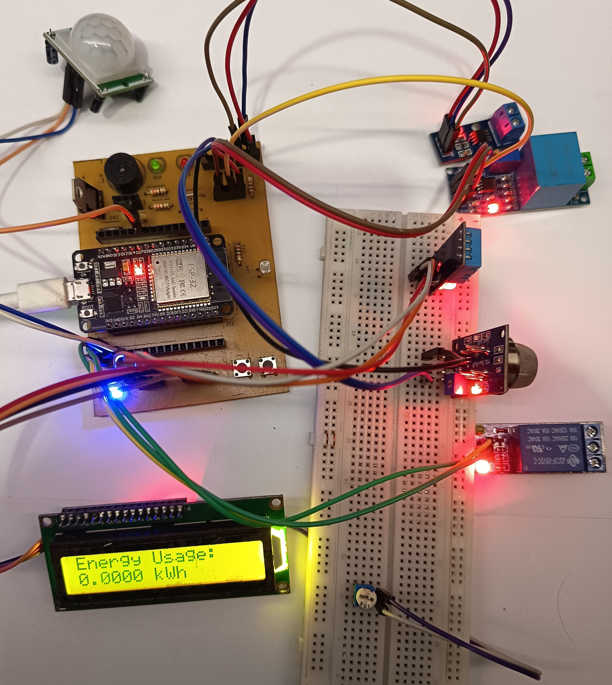

# Node Firmware - QHome Automation System

## Overview
This directory contains the firmware source code for the **- QHome Automation Node**. The firmware is designed to run on ESP-based microcontrollers (e.g., ESP8266 or ESP32), managing a suite of environmental and power monitoring sensors while maintaining real-time communication with the central server via MQTT.

## Directory Structure
- **`main/`**: The core Arduino sketch files using a modular `.ino` structure.
    - `main.ino`: Application entry point and orchestrator.
    - `config.*`: Configuration management.
    - `mqtt.*`: MQTT protocol implementation.
    - `*_sensor.*`: Driver logic for individual sensors.
- **`libraries/`**: Local copies of required libraries ensuring compatibility and portability.
- **`images/`**: Documentation assets.

## Hardware Support
The firmware is built to drive a specific PCB layout (see `../pcb/`) populated with the following components:

### Sensors
- **DHT11/DHT22**: Temperature and Humidity monitoring.
- **MQ Series (e.g., MQ-2, MQ-135)**: Air quality and gas detection.
- **PIR Sensor**: Motion detection for security or presence automation.
- **LDR (Light Dependent Resistor)**: Ambient light level sensing.
- **ZMPT101B**: AC Voltage sensing.
- **ACS712**: Current sensing.

### Outputs
- **LCD I2C (16x2 or 20x4)**: Visual status feedback.
- **Buzzer/Alarm**: Audible feedback for alerts and startup confirmation.

## Pin Configuration
The firmware is pre-configured for the following [ESP32](https://www.espressif.com/en/products/socs/esp32) pin mapping.

| Component | Pin (GPIO) | Type | Description |
| :--- | :--- | :--- | :--- |
| **Connectivity** | | | |
| WiFi Indicator LED | 15 | Output | Blinks/On when connected |
| WiFi Reset Button | 18 | Input | Hold 5s to reset credentials |
| **System** | | | |
| System Button | 19 | Input | General purpose / Manual logic |
| Error LED | 32 | Output | Indicates sensor faults |
| Buzzer | 25 | Output | Audio alerts |
| **Sensors** | | | |
| DHT11/22 | 4 | Input/Output | Digital Temp/Hum |
| PIR Motion | 13 | Input | Digital Motion Detect |
| MQ Gas | 34 | Analog (ADC) | Air Quality |
| Light (LDR) | 35 | Analog (ADC) | Ambient Light |
| ZMPT101B | 36 | Analog (ADC) | AC Voltage |
| ACS712 | 39 | Analog (ADC) | AC Current |
| **Controls** | | | |
| Manual Light Btn | 23 | Input | Toggle Relays manually |
| Relay 1 | 26 | Output | Light Control 1 |
| Relay 2 | 27 | Output | Light Control 2 |
| MQ Indicator LED | 33 | Output | High Gas Alert |
- **ESP32 Board Support**: Install ESP32 board manager in Arduino IDE.

### Library Dependencies
The project relies on specific libraries included in the `libraries/` folder or available via Arduino Library Manager:
*   `ArduinoJson` (Serialization)
*   `PubSubClient` (MQTT)
*   `LiquidCrystal_I2C` (Display)
*   `DHT sensor library` (Temperature)
*   `Adafruit Unified Sensor` (Base for DHT)
*   `WiFiManager` (Connection Portal)
| **Display (I2C)** | | | |
| SDA | 21 | Data | LCD I2C Data |
| SCL | 22 | Clock | LCD I2C Clock |

## System Workflow

### Logic Flowchart


## 📡 Sensor Data Publishing Flow

This diagram details the complete process of sensor data acquisition, processing, and MQTT publishing.

```mermaid
flowchart TD
    LoopStart([Main Loop Iteration]) --> CheckInterval{Sync<br/>Interval<br/>Reached?}
    
    CheckInterval -->|No| CheckSensorReadTime{Individual<br/>Sensor<br/>Read Time?}
    CheckInterval -->|Yes| StartDataCollection[Start Data Collection Cycle]
    
    CheckSensorReadTime -->|DHT Interval| ReadDHT
    CheckSensorReadTime -->|MQ Interval| ReadMQ
    CheckSensorReadTime -->|Power Interval| ReadPower
    CheckSensorReadTime -->|Light Interval| ReadLight
    CheckSensorReadTime -->|PIR Check| ReadPIR
    CheckSensorReadTime -->|No| WaitLoop[Continue Loop]
    WaitLoop --> LoopStart
    
    StartDataCollection --> ReadDHT[Read DHT Sensor]
    ReadDHT --> DHTSuccess{Read<br/>Success?}
    DHTSuccess -->|No| LogDHTError[Log DHT Error<br/>Send Error MQTT]
    LogDHTError --> SetDHTDefault[Use Last Valid Value<br/>or Default]
    SetDHTDefault --> ReadMQ
    
    DHTSuccess -->|Yes| ParseDHT[Parse Temperature<br/>& Humidity]
    ParseDHT --> ValidateDHT{Within<br/>Range?}
    ValidateDHT -->|No| LogDHTError
    ValidateDHT -->|Yes| StoreDHT[Store in<br/>Global Variables]
    StoreDHT --> CheckDHTThresholds{Temperature<br/>Threshold?}
    CheckDHTThresholds -->|High Temp| TriggerTempAlert[Trigger High Temp Alert<br/>Activate Buzzer]
    CheckDHTThresholds -->|OK| ReadMQ
    TriggerTempAlert --> SendAlertMQTT1[Send Alert MQTT<br/>Type: _alert<br/>Immediate Publish]
    SendAlertMQTT1 --> ReadMQ
    
    ReadMQ[Read MQ Gas Sensor]
    ReadMQ --> SampleMQ[Read Analog Pin<br/>Multiple Samples]
    SampleMQ --> AverageMQ[Calculate Average<br/>Reduce Noise]
    AverageMQ --> ConvertMQ[Convert to PPM<br/>Using Calibration]
    ConvertMQ --> StoreMQ[Store in<br/>Global Variable]
    StoreMQ --> CheckMQThreshold{Gas Level<br/>> Threshold?}
    CheckMQThreshold -->|Yes| TriggerGasAlert[Trigger Gas Alert<br/>Activate Buzzer<br/>LED Indicator ON]
    TriggerGasAlert --> SendAlertMQTT2[Send Alert MQTT<br/>Type: _alert<br/>alert_type: gas_detected]
    SendAlertMQTT2 --> ReadPIR
    CheckMQThreshold -->|No| LEDOff[Turn Off MQ<br/>Indicator LED]
    LEDOff --> ReadPIR
    
    ReadPIR[Read PIR Motion Sensor]
    ReadPIR --> PIRState{Motion<br/>Detected?}
    PIRState -->|Yes| SetMotionFlag[Set Motion Flag<br/>Update Timestamp]
    PIRState -->|No| ClearMotionFlag[Clear Motion Flag]
    SetMotionFlag --> CheckLightLogic[Check Auto Light Logic]
    ClearMotionFlag --> CheckLightLogic
    CheckLightLogic --> ReadLight
    
    ReadLight[Read Light Sensor LDR]
    ReadLight --> SampleLight[Read Analog Pin<br/>Multiple Samples]
    SampleLight --> AverageLight[Calculate Average]
    AverageLight --> ConvertLux[Convert to Lux<br/>Using Calibration]
    ConvertLux --> StoreLight[Store in<br/>Global Variable]
    StoreLight --> EvalAutoLight{Auto Mode<br/>Enabled?}
    EvalAutoLight -->|No| ManualControl[Check Manual<br/>Button State]
    ManualControl --> ReadPower
    
    EvalAutoLight -->|Yes| CheckConditions{Light < Threshold<br/>AND<br/>Motion Detected?}
    CheckConditions -->|Yes| TurnOnRelay[Turn ON Relay<br/>GPIO HIGH]
    CheckConditions -->|No| CheckTimeout{Relay ON<br/>AND<br/>Timeout Reached?}
    CheckTimeout -->|Yes| TurnOffRelay[Turn OFF Relay<br/>GPIO LOW]
    CheckTimeout -->|No| ReadPower
    TurnOnRelay --> ReadPower
    TurnOffRelay --> ReadPower
    
    ReadPower[Read Power Sensors]
    ReadPower --> SampleVoltage[Sample ZMPT101B<br/>Voltage Sensor<br/>100+ Samples]
    SampleVoltage --> CalculateRMSV[Calculate RMS Voltage<br/>AC Waveform Analysis]
    CalculateRMSV --> SampleCurrent[Sample ACS712<br/>Current Sensor<br/>100+ Samples]
    SampleCurrent --> CalculateRMSI[Calculate RMS Current<br/>AC Waveform Analysis]
    CalculateRMSI --> CalculatePower[Calculate Power<br/>P = V × I]
    CalculatePower --> UpdateEnergy[Update Energy Counter<br/>kWh = ∫P dt]
    UpdateEnergy --> StorePower[Store V, I, P, kWh<br/>in Global Variables]
    StorePower --> CheckPowerThreshold{Power<br/>> Threshold?}
    CheckPowerThreshold -->|Yes| TriggerPowerAlert[Trigger Power Alert<br/>Overload Detection]
    TriggerPowerAlert --> SendAlertMQTT3[Send Alert MQTT<br/>Type: _alert<br/>alert_type: power_overload]
    SendAlertMQTT3 --> PreparePayload
    CheckPowerThreshold -->|No| PreparePayload
    
    PreparePayload[Prepare JSON Payload]
    PreparePayload --> CreateJSON[Create JSON Object<br/>StaticJsonDocument]
    CreateJSON --> AddType[Add type: "_sensor_data"]
    AddType --> AddPayload[Add payload object]
    AddPayload --> AddNodeInfo[Add node_name, timestamp]
    AddNodeInfo --> AddDHTData[Add temperature, humidity]
    AddDHTData --> AddMQData[Add mq_value, mq_ppm]
    AddMQData --> AddLightData[Add light_level, light_lux]
    AddLightData --> AddMotionData[Add motion_detected]
    AddMotionData --> AddPowerData[Add acs_voltage, acs_current<br/>acs_power, acs_energy]
    AddPowerData --> AddRelayStates[Add relay_1_state, relay_2_state]
    AddRelayStates --> SerializeJSON[Serialize to String<br/>serializeJson]
    
    SerializeJSON --> CheckMQTT{MQTT<br/>Connected?}
    CheckMQTT -->|No| AttemptReconnect[Attempt MQTT Reconnect]
    AttemptReconnect --> ReconnectSuccess{Success?}
    ReconnectSuccess -->|No| LogMQTTError[Log MQTT Error<br/>Store Data Locally]
    LogMQTTError --> UpdateLCD
    ReconnectSuccess -->|Yes| PublishData
    
    CheckMQTT -->|Yes| PublishData[Publish to MQTT<br/>Topic: node/send<br/>QoS: 1]
    PublishData --> PublishSuccess{Published?}
    PublishSuccess -->|No| LogPublishError[Log Publish Error<br/>Retry Queue]
    LogPublishError --> UpdateLCD
    
    PublishSuccess -->|Yes| IncrementCounter[Increment Publish Counter<br/>Update Stats]
    IncrementCounter --> WaitAck[Wait for PUBACK<br/>from Broker]
    WaitAck --> UpdateLCD[Update LCD Display<br/>Show Latest Values<br/>Connection Status]
    
    UpdateLCD --> CycleLCDPages{Multiple<br/>LCD Pages?}
    CycleLCDPages -->|Yes| RotatePages[Rotate Display Pages<br/>Every 3 seconds]
    CycleLCDPages -->|No| DisplayMain[Display Main Page]
    RotatePages --> ListenCommands
    DisplayMain --> ListenCommands
    
    ListenCommands[Check for MQTT Commands<br/>Topic: node/cmd]
    ListenCommands --> CommandReceived{Command<br/>Received?}
    CommandReceived -->|No| CheckButtons
    
    CommandReceived -->|Yes| ParseCommand[Parse Command JSON]
    ParseCommand --> CommandType{Command<br/>Type?}
    
    CommandType -->|_command| ExtractCmd[Extract cmd field]
    ExtractCmd --> ExecCommand{Execute<br/>Command}
    ExecCommand -->|toggle_light| ToggleRelay[Toggle Relay State]
    ExecCommand -->|toggle_light_off| ForceOffRelay[Force Relay OFF]
    ExecCommand -->|restart| SystemRestart[System Restart<br/>ESP.restart]
    ExecCommand -->|reset_config| ResetConfig[Reset Config<br/>to Factory Defaults]
    
    ToggleRelay --> SendCmdAck
    ForceOffRelay --> SendCmdAck
    SystemRestart --> SendCmdAck
    ResetConfig --> ClearEEPROM[Clear EEPROM/SPIFFS]
    ClearEEPROM --> SendCmdAck
    
    CommandType -->|_config_update| ExtractConfig[Extract config object]
    ExtractConfig --> ValidateConfig{Valid<br/>Config?}
    ValidateConfig -->|No| SendErrorAck[Send Error ACK<br/>Invalid Config]
    SendErrorAck --> CheckButtons
    
    ValidateConfig -->|Yes| UpdateVariables[Update Runtime Variables<br/>Thresholds, Intervals]
    UpdateVariables --> SaveToEEPROM[Save Config to<br/>EEPROM/SPIFFS]
    SaveToEEPROM --> SendCmdAck[Send ACK MQTT<br/>Type: _ack<br/>status: success]
    SendCmdAck --> CheckButtons
    
    CheckButtons[Check Physical Buttons]
    CheckButtons --> WiFiButtonPressed{WiFi Reset<br/>Button Held<br/>5 seconds?}
    WiFiButtonPressed -->|Yes| ClearWiFiConfig[Clear WiFi Credentials<br/>Restart to AP Mode]
    ClearWiFiConfig --> SystemRestart
    
    WiFiButtonPressed -->|No| ManualButtonPressed{Manual Light<br/>Button<br/>Pressed?}
    ManualButtonPressed -->|Yes| ManualToggle[Toggle Relay Manually<br/>Override Auto Mode]
    ManualToggle --> Debounce[Debounce Delay]
    Debounce --> LoopStart
    
    ManualButtonPressed -->|No| CheckWatchdog[Feed Watchdog Timer]
    CheckWatchdog --> LoopStart
    
    style ReadDHT fill:#e3f2fd
    style ReadMQ fill:#fff3e0
    style ReadPIR fill:#e8f5e9
    style ReadLight fill:#f3e5f5
    style ReadPower fill:#ffe0b2
    style PublishData fill:#c8e6c9
    style TriggerGasAlert fill:#ffcdd2
    style TriggerTempAlert fill:#ffcdd2
    style TriggerPowerAlert fill:#ffcdd2
```

### Data Publishing Characteristics

**Sensor Polling Intervals**
- **DHT11/22**: 2000ms (2 seconds) - Limited by sensor response time
- **MQ Gas Sensor**: 1000ms (1 second) - Continuous monitoring for safety
- **PIR Motion**: 500ms (0.5 seconds) - Fast response for automation
- **Light Sensor**: 1000ms (1 second) - Ambient light monitoring
- **Power Sensors**: 100ms (0.1 seconds) - High-frequency sampling for AC waveform accuracy

**MQTT Publishing Strategy**
- **Periodic Sync**: Every 60 seconds (configurable via `sync_interval`)
- **Immediate Alerts**: Threshold breaches published instantly, bypassing sync interval
- **QoS Level 1**: At least once delivery guarantee with PUBACK acknowledgment
- **Retry Logic**: Failed publishes queued for retry with exponential backoff

**Data Format & Structure**
```json
{
  "type": "_sensor_data",
  "payload": {
    "node_name": "Living Room Node",
    "timestamp": 1705315200000,
    "temperature": 28.5,
    "humidity": 65.2,
    "mq_value": 250,
    "mq_ppm": 45,
    "light_level": 512,
    "light_lux": 150,
    "motion_detected": true,
    "acs_voltage": 230.5,
    "acs_current": 2.5,
    "acs_power": 576.25,
    "acs_energy": 12.45,
    "relay_1_state": true,
    "relay_2_state": false
  }
}
```

**Alert Payload Example**
```json
{
  "type": "_alert",
  "payload": {
    "alert_type": "gas_detected",
    "message": "High gas levels detected! MQ Value: 850 PPM",
    "severity": "critical",
    "timestamp": 1705315260000,
    "sensor_value": 850,
    "threshold": 400
  }
}
```

**Error Reporting**
```json
{
  "type": "_error",
  "payload": {
    "error_type": "dht_read_failure",
    "message": "Failed to read from DHT sensor after 3 retries",
    "timestamp": 1705315280000,
    "component": "DHT11",
    "pin": 4
  }
}
```

---

### Operational Logic
The system operates on a non-blocking loop structure:

1.  **Initialization**:
    *   Loads settings from EEPROM/SPIFFS.
    *   Attempts to connect to the last known Wi-Fi. If it fails or is unconfigured, it launches a generic "Captive Portal" allowing the user to configure Network and MQTT credentials via a phone or PC.

2.  **Sensor Handling**:
    *   **Polling**: Sensors are polled at defined intervals (e.g., Temperature every 2 seconds, Power every 100ms) to ensure responsiveness without flooding the processor.
    *   **Smoothing**: Analog sensors (ACS712, ZMPT101B) use sampling algorithms to calculate RMS (Root Mean Square) values for accurate AC readings.

3.  **Automation Rules**:
    *   **Light Control**: If `Ambient Light < Threshold` AND `Motion Detected`, the Relay is triggered ON. It turns OFF after a timeout.
    *   **Safety**: If `Gas > Threshold` or `Temp > Threshold`, the **Buzzer** sounds and a specific Alert MQTT message is sent immediately, bypassing the normal sync interval.

## Software Features

### 1. Modular Architecture
The code is split into independent modules for each component. This makes code maintenance and feature addition easier.
- `init[Component]()`: Initialization routines.
- `maintain[Component]()` or Loop logic: Handled in the main loop or timer-based checks.

### 2. Connectivity & Communication
- **WiFi Manager**: Onboard access point generation for easy detailed Wi-Fi credential configuration without hardcoding.
- **MQTT Protocol**:
    - **Publish Topic**: `node/send` - Sends JSON payloads containing sensor readings.
    - **Subscribe Topic**: `node/cmd` - Listens for remote commands (configuration updates, actuator control).

### 3. Dynamic Configuration
Key parameters are configurable (likely stored in persistent memory):
- **Network**: MQTT Broker IP, Port, Credentials.
- **Sensor Thresholds**: Trigger values for Light, Temperature, and Gas.
- **Intervals**: Read and Sync frequency timers.

## Installation & Setup

### Prerequisites
- **Arduino IDE**: Download and install the latest version.
- **Board Drivers**: Ensure drivers for your specific ESP board (CH340, CP210x) are installed.

### Steps
1.  **Library Configuration**:
    The generic `libraries/` folder is included. You can either copy these to your Arduino `libraries` folder or ensure the IDE points to this location.
2.  **Open Project**:
    Navigate to `main/` and open `main.ino`. The Arduino IDE should automatically load all associated `.h` and `.ino` tabs.
3.  **Port Selection**:
    Select your board type (e.g., `NodeMCU 1.0 (ESP-12E Module)`) and the correct COM port.
4.  **Upload**:
    Compile and upload the firmware.

## Usage
1.  **Initial Boot**: The system will initialize components and display a progress bar on the LCD.
2.  **Configuration Mode**: If Wi-Fi is not configured, the device may broadcast a hotspot. Connect to it to set up local Wi-Fi credentials.
3.  **Operation**: Once connected, the device will periodically read sensors and publish data to the configured MQTT broker. "Long Beep" indicates the system is ready and running.

## Visuals

### Assembled Device


---