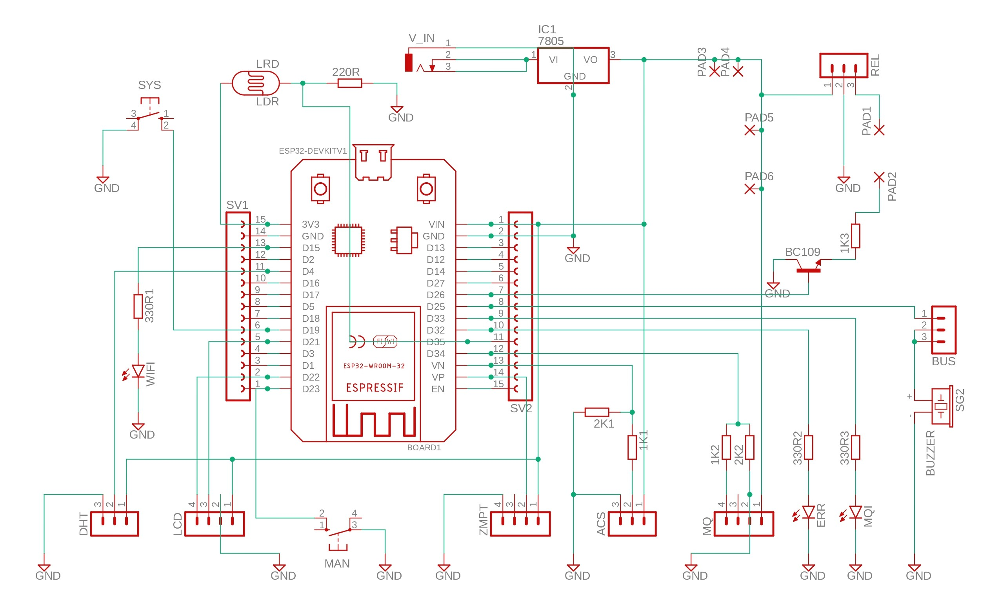
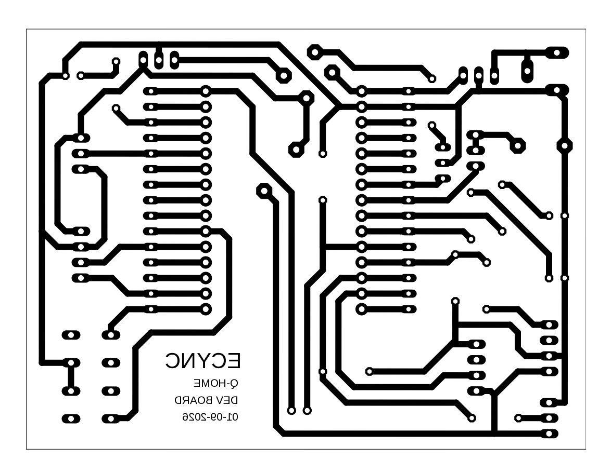
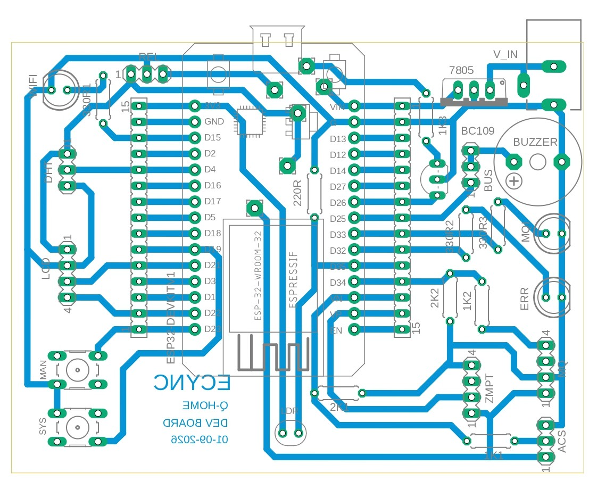

# PCB Design - QHome Automation System

## Overview
This directory contains the Eagle CAD design files for the **QHome** main controller board. This PCB is the hardware backbone of the Home Automation System, designed to integrate the microcontroller with various environmental sensors, power monitoring modules, and communication interfaces.

## Project Structure
- **[QHome.sch](QHome.sch)**: The schematic design file detailing the circuit logic and connections.
- **[QHome.brd](QHome.brd)**: The printed circuit board layout file used for fabrication.
- **[QHome.dru](QHome.dru)**: The Design Rule Check (DRC) file defining manufacturing constraints.

## Visuals

### Schematic Diagram

### PCB Layout (Trace View)

### Component View (3D/Assembly)

## Hardware Specifications

### Supported Microcontroller
The board is designed to host an ESP-based microcontroller (e.g., ESP8266 NodeMCU or ESP32), handling Wi-Fi connectivity and MQTT communication.

### Sensor & Peripheral Interfaces
Based on the firmware modules, this PCB includes interfaces for:

1.  **Power Monitoring**:
    *   **Voltage**: Interface for ZMPT101B AC voltage sensor.
    *   **Current**: Interface for ACS712 current sensor.
2.  **Environmental Monitoring**:
    *   **Climate**: Header for DHT11/DHT22 (Temperature & Humidity).
    *   **Air Quality**: Heading for MQ-series gas sensors (e.g., MQ-2, MQ-135).
    *   **Light**: Analog input for Light Dependent Resistor (LDR).
    *   **Presence**: Input for PIR Motion Sensor.
3.  **User Interface**:
    *   **Display**: I2C header for 16x2 or 20x4 Liquid Crystal Display (LCD).

## Fabrication Details
*   **Layers**: 2-Layer (Top & Bottom Signal/Polygon pours).
*   **Material**: Standard FR-4.
*   **Mask**: Green (or preferred color).
*   **Silkscreen**: Top side for component placement guides.

## Assembly Instructions
1.  **PCB Manufacturing**: Export Gerber files from `QHome.brd` or send the `.brd` file directly to a supported PCB fabrication house (e.g., OSH Park, PCBWay, JLCPCB).
2.  **Sourcing Components**: Generate a Bill of Materials (BOM) from `QHome.sch` inside Eagle CAD.
3.  **Soldering**:
    *   Start with low-profile components (resistors, diodes).
    *   Install headers and connectors (JST, Dupont, or screw terminals).
    *   Solder larger modules or sockets for the microcontroller and sensors.
4.  **Testing**: Before inserting the MCU, power the board and check voltage rails (5V, 3.3V) with a multimeter to facilitate safe operation.

## Design Tools
*   **Software**: Autodesk EAGLE (or compatible EDA software like Fusion 360 Electronics).

---

